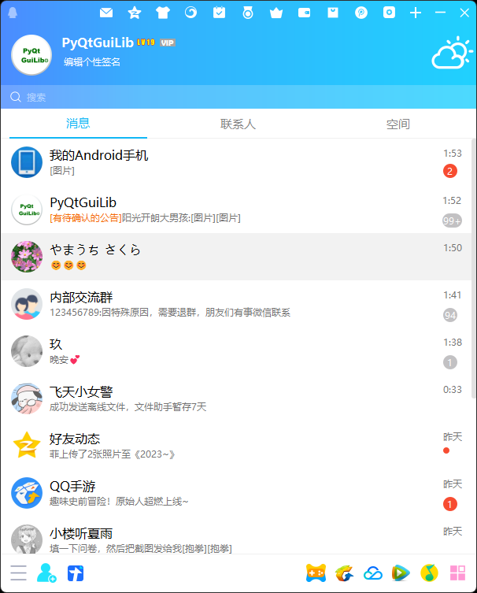
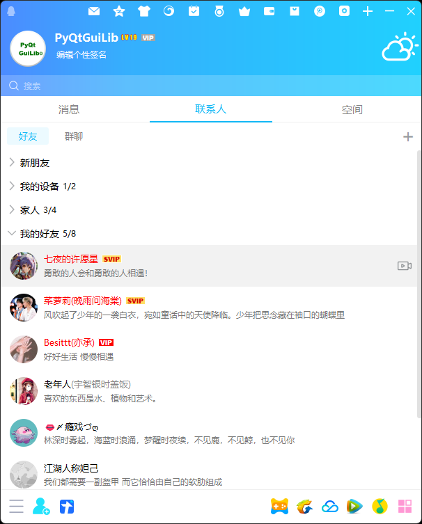
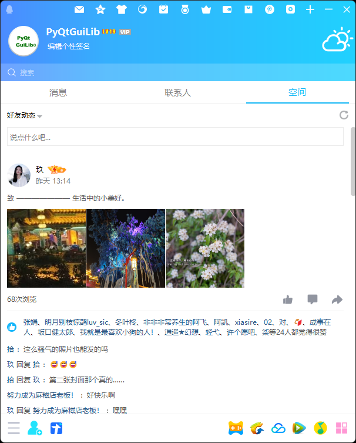

<h1 align="center">
  PyQtGuiLib-UI
</h1>
<p align="center">
  Imitate QQ interface with PyQtGuiLib
</p>

<div align=center>

</div>

## 说明

```
这是一个模仿QQ的项目，尽量使用了Qt Designer设计开发，基于PyQtGuiLib库用低逻辑代码实现基础功能。
因为只使用Qt Designer能实现的功能实在有限，所以还是写了一部分逻辑代码。而且由于时间原因目前只是
简单地模仿了一下ui，后续会慢慢实现大部分的界面及界面交互。欢迎志同道合的朋友加群546747413一起交流！
```

## python版本需求
```
3.xxx 以上
```
## python下qt支持的版本
```
pyside2, pyside6, pyqt5, pyqt6 
```
## 系统支持
```
win, mac
```

## 安装
```shell
pip install PyQtGuiLib
```
